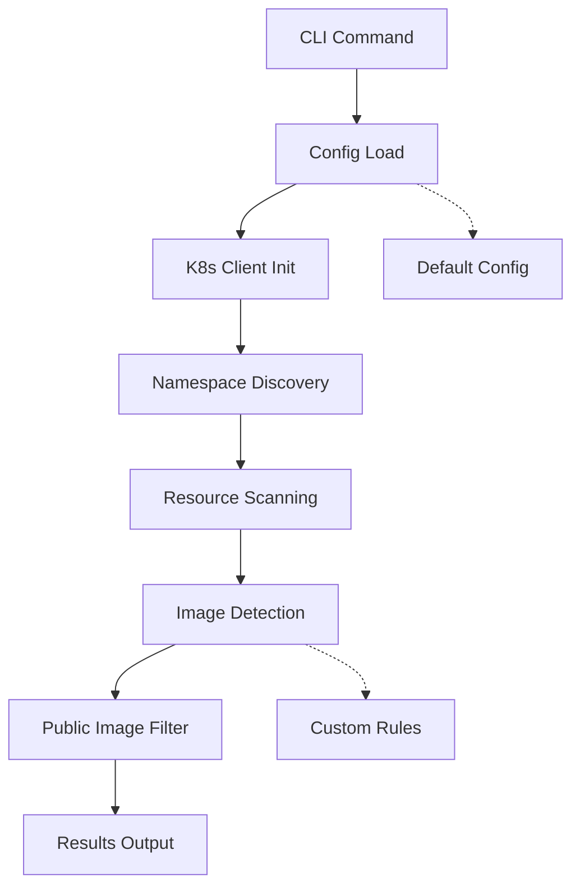

# 🔧 Technical Overview

## Arquitetura Detalhada

### Core Components

#### 1. **CLI Layer** (`internal/cli/`)
- **Framework**: Cobra para interface de linha de comando
- **Comandos**: `scan`, `migrate`, `init`, `status`
- **Flags**: Suporte a configurações via parâmetros
- **i18n**: Sistema de internacionalização integrado

#### 2. **Configuration System** (`internal/config/`)
- **Formato**: YAML para facilidade de uso
- **Localização**: `~/.privateer/config.yaml`
- **Validação**: Schemas automáticos com defaults
- **Override**: Flags CLI sobrescrevem configuração

#### 3. **Kubernetes Integration** (`internal/kubernetes/`)
- **Client**: kubernetes/client-go official
- **Resources**: Deployments, StatefulSets, DaemonSets, Jobs, CronJobs
- **Auth**: Suporte a kubeconfig padrão
- **Contexts**: Multi-cluster ready

#### 4. **Image Detection Engine** (`internal/kubernetes/scanner.go`)
```go
// Lógica de detecção inteligente
func (s *Scanner) isPublicImage(imageName string) bool {
    // 1. Verifica registries ignorados
    // 2. Verifica registries privados customizados  
    // 3. Verifica registries públicos customizados
    // 4. Aplica heurísticas padrão
}
```

#### 5. **Logging System** (`internal/logger/`)
- **Framework**: Zerolog para performance
- **Estrutura**: JSON estruturado com console writer
- **i18n**: Mensagens traduzidas via arquivos YAML
- **Levels**: Debug, Info, Warn, Error

### Data Flow



### Image Detection Logic

#### Built-in Rules
```yaml
# Automatically detected as PRIVATE
private_patterns:
  - "*.dkr.ecr.*.amazonaws.com/*"     # ECR Private
  - "*.azurecr.io/*"                   # ACR Private  
  - "*.gcr.io/*"                       # GCR Private
  - "ghcr.io/*/*"                      # GHCR Private
  - "*/*./*"                           # Domain-based registries

# Automatically detected as PUBLIC  
public_patterns:
  - "docker.io/*/*"                    # DockerHub
  - "quay.io/*/*"                      # Quay.io
  - "registry.k8s.io/*"                # Kubernetes
  - "public.ecr.aws/*/*"               # ECR Public
```

#### Custom Override System
```yaml
image_detection:
  custom_private_registries:
    - "docker.io/mycompany"            # Force private
    - "internal-registry.local"
    
  custom_public_registries:  
    - "registry.k8s.io"                # Force public
    - "quay.io/prometheus"
    
  ignore_registries:
    - "localhost"                      # Skip entirely
    - "127.0.0.1"
```

## Build System

### Multi-Platform Builds
```bash
# Automated builds for:
# - Linux: AMD64, ARM64
# - macOS: AMD64, ARM64 (Apple Silicon)  
# - Windows: AMD64, ARM64

make release  # Builds all platforms
```

### Installation Methods

#### 1. **Script Installation**
```bash
# Linux/macOS
curl -sSL .../install.sh | bash

# Windows PowerShell
irm .../install.ps1 | iex
```

#### 2. **Manual Installation**
- Detects OS/Architecture automatically
- Adds to PATH (`/usr/local/bin` or `~/.local/bin`)
- Creates necessary directories

### Development Workflow

#### Local Development
```bash
make dev                    # Build and install dev version
make run ARGS="scan cluster --dry-run"  # Quick test
make test                   # Run test suite
make lint                   # Code quality checks
```

#### Release Process
```bash
make release VERSION=v1.0.0  # Tagged release build
make clean                    # Cleanup artifacts
```

## Configuration Deep Dive

### Config Precedence (High → Low)
1. CLI Flags (`--language`, `--dry-run`)
2. Environment Variables (planned)
3. Config File (`~/.privateer/config.yaml`)
4. Built-in Defaults

### Registry Configuration
```yaml
registries:
  - name: "production-ecr"
    type: "ecr"
    region: "us-east-1"
    account_id: "123456789012"    # Optional
    
  - name: "staging-harbor"  
    type: "harbor"
    url: "harbor.staging.company.com"
    project: "images"             # Harbor project
    
  - name: "backup-ghcr"
    type: "ghcr" 
    organization: "mycompany"
    visibility: "private"
```

### Distribution Strategies (Planned)
```yaml
distribution:
  strategy: "rules"              # single, multi, rules, load_balance
  
  rules:
    - name: "production-critical"
      match:
        namespaces: ["production"] 
        labels:
          tier: "critical"
      targets: ["production-ecr", "backup-ghcr"]
      
    - name: "development"
      match:
        namespaces: ["dev", "staging"]
      targets: ["staging-harbor"]
```

## Error Handling

### Graceful Failures
- **Connection Issues**: Retry with exponential backoff
- **Authentication**: Clear error messages with suggestions
- **Partial Failures**: Continue processing, log failures
- **Config Errors**: Validation with helpful messages

### Logging Strategy
```go
// Structured logging with context
log.Error("k8s_connection_failed").
    Str("context", contextName).
    Str("cluster", clusterURL).
    Err(err).
    Send()
```

## Security Considerations

### Credentials Management
- **kubeconfig**: Standard Kubernetes authentication
- **Registry Auth**: Support for standard credential helpers
- **Secrets**: Never log sensitive information
- **RBAC**: Respect Kubernetes RBAC permissions

### Least Privilege
- **Read-Only**: Scanner only needs read permissions
- **Namespace Scoped**: Can be limited to specific namespaces
- **Audit Trail**: All actions logged with structured events

## Performance Optimization

### Concurrent Processing
```go
// Parallel namespace scanning
var wg sync.WaitGroup
semaphore := make(chan struct{}, maxConcurrency)

for _, namespace := range namespaces {
    wg.Add(1)
    go func(ns string) {
        defer wg.Done()
        // Process namespace...
    }(namespace)
}
```

### Memory Management
- **Streaming**: Large result sets processed in chunks
- **Connection Pooling**: Efficient Kubernetes API usage
- **Resource Cleanup**: Proper cleanup of connections

## Testing Strategy

### Unit Tests
- **Config Loading**: Various config scenarios
- **Image Detection**: All registry patterns
- **CLI Commands**: Flag parsing and validation

### Integration Tests  
- **Kubernetes**: Real cluster interaction
- **Registry**: Authentication and connectivity
- **End-to-End**: Full migration workflows

### Mock Framework
```go
// Kubernetes client mocking
type mockK8sClient struct {
    deployments []appsv1.Deployment
    // ...
}
```

## Monitoring & Observability

### Metrics (Planned)
- **Images Processed**: Total count per run
- **Success Rate**: Migration success percentage
- **Performance**: Scan duration metrics
- **Errors**: Categorized error counts

### Audit Logging
```json
{
  "timestamp": "2025-01-24T10:00:00Z",
  "operation": "image_migration",
  "source": "docker.io/nginx:latest",
  "destination": "ecr.aws/company/nginx:latest", 
  "status": "success",
  "user": "admin",
  "cluster": "production"
}
```

## Future Architecture

### Planned Components

#### Registry Abstraction Layer
```go
type Registry interface {
    Push(image *Image) error
    Pull(image *Image) error
    Tag(image *Image, newTag string) error
    Auth() error
}
```

#### Migration Engine
```go
type MigrationEngine struct {
    source   Registry
    targets  []Registry  
    strategy DistributionStrategy
}
```

#### GitHub Integration
```go
type GitHubScanner struct {
    client   *github.Client
    patterns []string  // Dockerfile, docker-compose.yml
}
```

### Scalability Considerations
- **Worker Pools**: Configurable concurrency
- **Rate Limiting**: Respect registry limits
- **Batch Processing**: Efficient bulk operations
- **Caching**: Image metadata caching